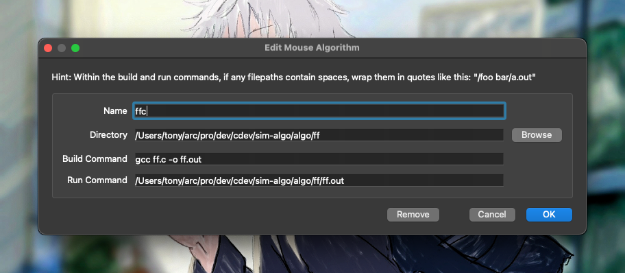

# Algorithm Simulations

This repository contains maze solving algorithms that are under simulation testing.
Currently we are using the [mms simulator](https://github.com/mackorone/mms) by mackorone for our software simulations of maze navigation.

## Getting Started

1. Have the [relevant mms simulator downloaded](https://github.com/mackorone/mms?tab=readme-ov-file#download) and running on your platform.
2. Clone this repo
3. Check if you have relevant c toolchain available for your platfrom to compile the C algorithm example.

> [!NOTE]
>
> You can try to install gcc or msvc if you are on Windows. Unix platforms generally include gcc.
> For an even easier setup on Windows try using [Zig](https://ziglang.org/download/) as a C compiler.

4. Click any of the two buttons next to Mouse in the Simulator and add the relevant algorithm you want to test.
add image below



- Enter the algorithm directory you want to test in the Directory field
- Build command uses gcc for the ff.c algorithm
- The Run Command should have the absolute path to the .out file to avoid any unwanted errors

```sh
# you can edit the ff.c to the c file you want to test and keep the others as is
gcc test.c -o ff.out

# if you don't want to bother with installing gcc 
# and have added zig in your path
# just replace gcc with zig cc
zig cc test.c -o ff.out

```


## Project Structure

```
sim-algo/
├── algo/          # Algorithms directory
│   └── ff/        # Flood-Fill Algorithms in testing
│       ├── api.h  # mms simulator api interface in c
│       ├── ff.c   # Currently testing Flood-Fill Algorithm
│       └── ffv1.c # Flood-Fill Implementaion V1
├── license        # License information
└── readme.md      # This file
```

## Contributing

1. Fork the repository
2. Create a feature branch
3. Commit your changes
4. Push to the branch
5. Create a Pull Request
